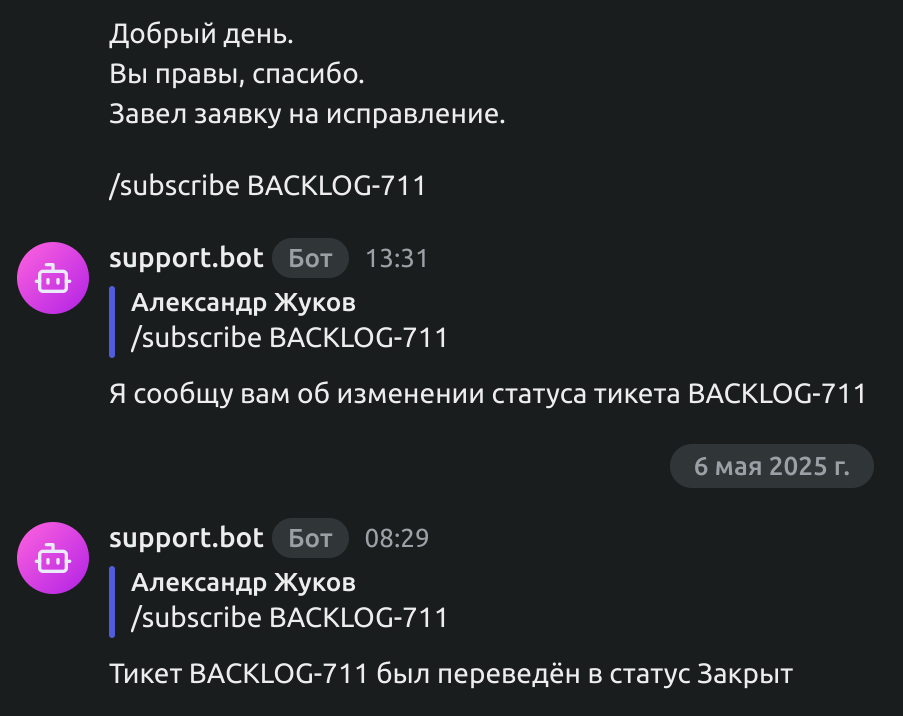
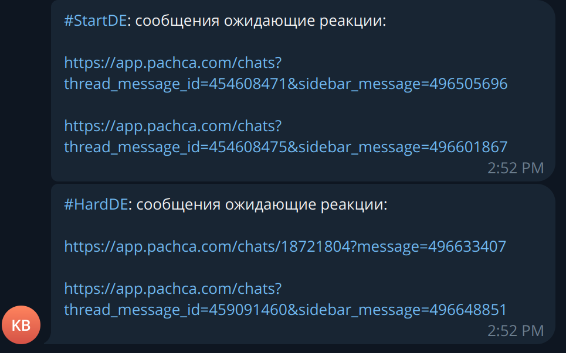

### Quality of life bot for experts on StartDE & HardDE

#### Features:
- Tracking BACKLOG tickets status

- Notifying about student questions in telegram

#### How to run locally:
- Make sure all necessary envs are set in .env, check app/config.py for the list of envs
- `docker compose up --build -d && docker compose logs -tf`

#### Before merge request
Pipeline checks that
- All tests are passed: `pytest tests`
- Code formatting is done correcly with Ruff: `ruff check`
- Strict mypy configuration is passed: `mypy --strict app`
